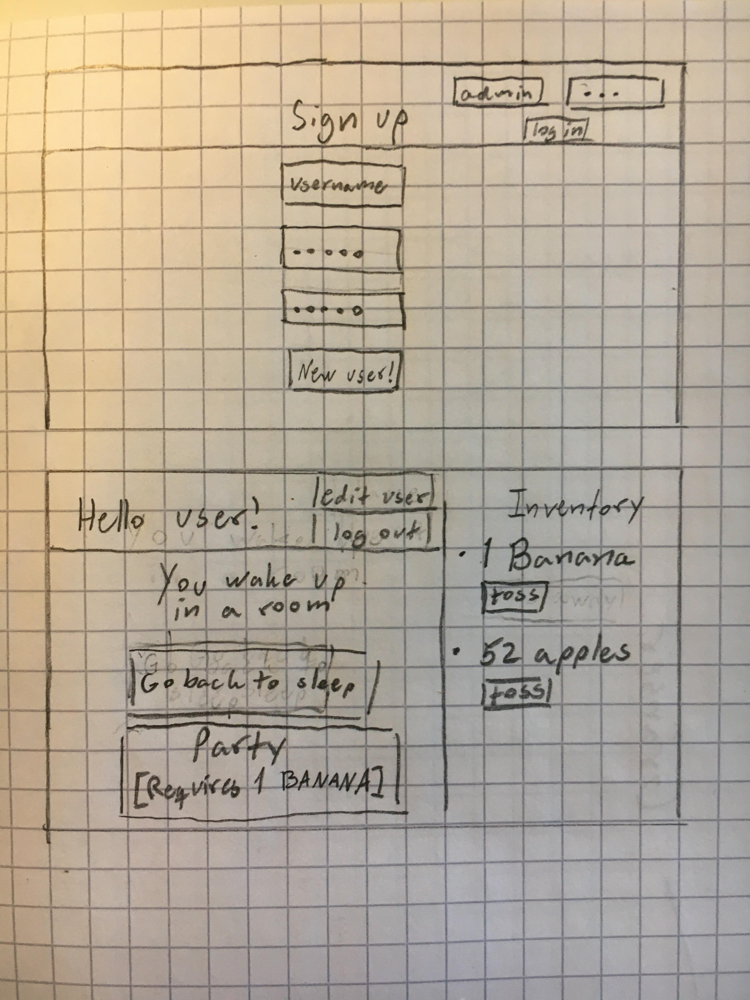
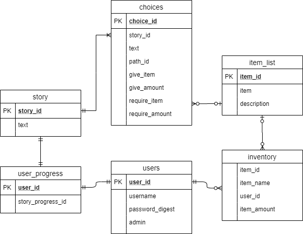

# Projektplan

## 1. Projektbeskrivning (Beskriv vad sidan ska kunna göra)
Sidan ska kunna presentera scenarion och val till användaren. Olika val leder till olika nya scenarion och utvecklas till en historia de kan följa. Användaren har även tillgång till ett inventory med föremål de kan få av och använda till olika val.
## 2. Vyer (visa bildskisser på dina sidor)

## 3. Databas med ER-diagram (Bild)

## 4. Arkitektur (Beskriv filer och mappar - vad gör/innehåller de?)
### Ruby-filer:
- app.rb -innehåller alla routes, sessions, felhantering, mm. All logik som är kopplad till kommunikation mellan servern och klienten.
- model.rb - innehåller funktioner som tar kontakt med databasen, samt kryptering.
### Slim-filer:
- index.slim - Login-sidan.
- start.slim - "Sidan där allting händer". Det är här en inloggad användare faktiskt kan använda sidan och spela "spelet".
- layout.slim - Layout-fil som gäller för alla andra slim-filer. Finns inte så mycket här förutom instruktioner att koppla sig till css-filen.
- error.slim - Sidan som visas om någonting inte verkar stämma.
#### /users/
- edit.slim - Sidan där användaren kan ändra sin användare.
### Andra filer:
- main.css - Css-fil. Instruktioner för utseende.
